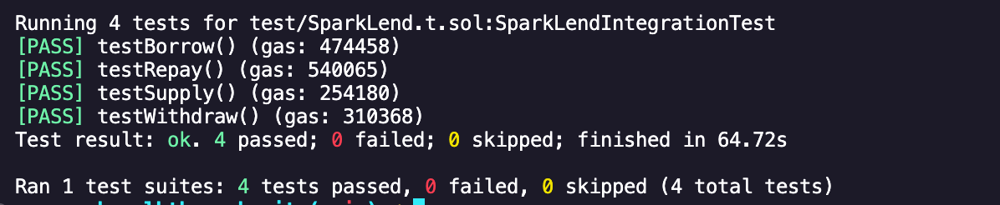

# A quick guide to integrate SparkLend with your protocol

## <u>A brief intro about SparkLend </u>

The SparkLend Protocol is decentralised non-custodial liquidity protocol where users can participate as suppliers, borrowers or liquidators. Suppliers provide liquidity to a market and can earn interest on the crypto assets provided, while borrowers are able to borrow in an overcollateralized fashion. Borrowers can also engage in one-block borrow transactions (”flash loans”), which do not require overcollateralization. [Read more here](https://docs.spark.fi/#welcome-to-spark) </br>
In this guide we will cover the basic functions of the protocol and how to start using it in your protocol.

### Step 1: Install Foundry

You can install Foundry, comprising all of its tools using Foundryup. To do it, run the following command in your terminal (for Windows, use [Git Bash](https://gitforwindows.org/) or [WSL](https://learn.microsoft.com/en-us/windows/wsl/install)):

```
curl -L https://foundry.paradigm.xyz | bash
```

</br>

### Step 2: Create a project using Foundry

We will create a fresh project using foundry. For this, first go to your directory of choice, then run the following command in your terminal:

```
forge init integrating_spark
cd integrating_spark
```

This will create a new directory called `integrating_spark` and will initialise a new project in it. You also get a new git repository initialised as well.</br>
Next, if you will use VSCode, you can open the project in VSCode by running the following command in your terminal:

```
code .
```

If everything is executed correctly, you should see a `Counter.sol` file in the `src` folder, and its corresponding deployment and test files in the `script` and `test` folder repectively. </br>

### Step 3: Let's build SparkLend's basic implementation

Now, SparkLend has a lot of features, but for this walkthrough we will only be covering the basic functions of the protocol which are **'supply'**, **'borrow'**, **'withdraw'** and **'repay'**. </br>
But first, let's get the initial contract setup done. </br>

#### Step 3.1: Creating the contract

Create a new file called `SparkLend.sol` in the `src` directory. </br>
Now, paste this code in the file: </br>

```
// SPDX-License-Identifier: MIT
pragma solidity ^0.8.21;

import "./IPool.sol";
import "./IERC20.sol";

contract SparkLendIntegration {
    IPool public pool;
    IERC20 public dai;
    IERC20 public weth;

    constructor(address _pool, address _dai, address _weth) {
        pool = IPool(_pool);
        dai = IERC20(_dai);
        weth = IERC20(_weth);
        // poolAddress = _pool;
    }

}
```

Here, you can see our contract imports 2 interfaces - `IPool` and `IERC20`. `IPool` is used for integrating with the pool and `IERC20` for interacting with the two token contracts we will work with: DAI and WETH</br>
In the same folder as the `SparkLend.sol` file, create a new file called `IPool.sol` and paste the [code from here](https://etherscan.io/address/0x8115366Ca7Cf280a760f0bC0F6Db3026e2437115#code#F16#L1) </br>
Similarly, create a new file called `IERC20.sol` and paste the [code from here](https://etherscan.io/address/0x8115366Ca7Cf280a760f0bC0F6Db3026e2437115#code#F21#L1). </br>
Now, if you look at the `IPool.sol` file, you'll notice it inherits the `DataTypes.sol` file. So, create a new file called `DataTypes.sol` and paste the [code from here](https://etherscan.io/address/0x8115366Ca7Cf280a760f0bC0F6Db3026e2437115#code#F12#L1). </br>
Now, we are ready to tackle the functions!

#### Step 3.2: Supply

This function is used to supply assets to the protocol. It takes 4 arguments - `asset`, `amount`, `onBehalfOf` and `referralCode`. `asset` is the address of the token you want to supply (WETH in this case) and `amount` is the amount of tokens you want to supply. The `onBehalfOf` address will be able to withdraw assets from the pool and is also the one to receive the spTokens. The `referralCode` can be 0 for our use case.</br> (Imp note: to call this token you'd need to call `approve` on the WETH contract first to allow it to spend the funds on your behalf) </br>

Now, let's write the function below in the contract. </br>

```
    function supply(
        address asset,
        uint256 amount,
        address onBehalfOf,
        uint16 referralCode
    ) external {
        require(
            IERC20(asset).transferFrom(msg.sender, address(this), amount),
            "Failed to transfer DAI to SparkLendIntegration"
        );
        require(
            IERC20(asset).approve(address(pool), amount),
            "Failed to approve DAI for Pool contract"
        );
        pool.supply(asset, amount, onBehalfOf, referralCode);
    }
```

Here, the first `require` statement is used to transfer the tokens from the user to the contract. The second `require` statement is used to approve the tokens for the pool contract. Finally, we call the `supply` function on the pool contract. </br>

#### Step 3.3: Borrow

This function is used to borrow assets from the protocol. It takes 5 arguments - `asset`, `amount`, `interestRateMode`, `onBehalfOf` and `referralCode`. `asset` is the address of the token you want to borrow (DAI in this case) and `amount` is the amount of tokens you want to borrow. The `interestRateMode` is the type of interest rate you want to borrow at. It can be either `Stable` or `Variable` (we will put 2 for `Variable` in our case). The `onBehalfOf` address will be the one to incur the debt. The `referralCode` can be 0 for our use case. </br>
Now let's write the function below in the contract. </br>

```
    function borrow(
        address asset,
        uint256 amount,
        uint256 interestRateMode,
        uint16 referralCode,
        address onBehalfOf
    ) external {
        pool.borrow(asset, amount, interestRateMode, referralCode, onBehalfOf);
        IERC20(asset).transfer(msg.sender, amount);
    }
```

Here, we first call the `borrow` function on the pool contract. Then, we transfer the borrowed tokens to the user. This whole function can only be executed once we have supplied tokens using the `supply` function. </br>

#### Step 3.4: Withdraw

This function is used to withdraw assets from the protocol. It takes 3 arguments - `asset`, `amount` and `to`. `asset` is the address of the token you want to withdraw (WETH in this case) and `amount` is the amount of tokens you want to withdraw. The `to` address will be the one to receive the tokens. </br>
Now, let's write the function below in the contract. </br>

```
    function withdraw(
        address asset,
        uint256 amount,
        address to
    ) external returns (uint256) {
        pool.withdraw(asset, amount, to);
        IERC20(asset).transfer(msg.sender, amount);
    }
```

Here, in our implementation, we first call the `withdraw` function on the pool contract. Then, we transfer the withdrawn tokens to the user. </br>

#### Step 3.5: Repay

This function is used to repay assets to the protocol. It takes 5 arguments - `asset`, `amount`, `onBehalfOf`, `rateMode` and `referralCode`. `asset` is the address of the underlying asset and `amount` is the amount of tokens you want to repay. The `onBehalfOf` address will be the one to repay the debt. The `rateMode` is the type of interest rate you want to repay at. It will be same as what we will put in the **'borrow'** function, as would be the `referralCode` </br>
Now, let's write the function below in the contract. </br>

```
    function repay(
        address asset,
        uint256 amount,
        uint256 rateMode,
        address onBehalfOf
    ) external returns (uint256) {
        require(
            IERC20(asset).transferFrom(msg.sender, address(this), amount),
            "Failed to transfer DAI to SparkLendIntegration"
        );
        require(
            IERC20(asset).approve(address(pool), amount),
            "Failed to approve DAI for Pool contract"
        );
        pool.repay(asset, amount, rateMode, onBehalfOf);
    }
```

Here, the first `require` statement is used to transfer the tokens from the user to the contract. The second `require` statement is used to approve the tokens for the pool contract. Finally, we call the `repay` function on the pool contract. </br>

This is it for the contract! Now, let's move on to the deployment script. </br>

### Step 4: Write our deployment script

To deploy our contract, we will have to write a deployment script in solidity in the `script` directory. </br>
Create a new file called `SparkLend.s.sol` in the `script` directory and paste the following code in it: </br>

```
//SPDX-License-Identifier: MIT
pragma solidity ^0.8.21;

import "forge-std/Script.sol";
import "../src/SparkLend.sol";

contract SparkLendScript is Script {
    function run() external {
        uint256 deployerPrivateKey = vm.envUint("PRIVATE_KEY");
        vm.startBroadcast(deployerPrivateKey);

        SparkLendIntegration sparkLendIntegration = new SparkLendIntegration(
            0xC13e21B648A5Ee794902342038FF3aDAB66BE987,
            0x6B175474E89094C44Da98b954EedeAC495271d0F,
            0xC02aaA39b223FE8D0A0e5C4F27eAD9083C756Cc2
        );
        vm.stopBroadcast();
    }
}
```

Now, to test and interact with our contract we will write a test file in the `test` directory, and we will fork Ethereum network to directly interact with SparkLends's deployed contracts.</br>

### Step 5: Interacting with the smart contracts

Finally, with all the setup done, we can start interacting with the smart contracts. First, let us make the test file. </br>

#### Step 5.1: Creating the contract

Create a new file called `SparkLend.t.sol` in the `src` directory. </br>
Now, paste this code in the file: </br>

```
//SPDX-License-Identifier: MIT
pragma solidity ^0.8.21;

import {Test, console2} from "forge-std/Test.sol";
import "forge-std/StdUtils.sol";
import "forge-std/console.sol";
import {SparkLendIntegration} from "../src/SparkLend.sol";
import {IERC20} from "../src/IERC20.sol";
import {IPool} from "../src/IPool.sol";

contract SparkLendIntegrationTest is Test {
    SparkLendIntegration public sparkLend;
    IERC20 public dai;
    IERC20 public weth;

    function setUp() public {
        sparkLend = new SparkLendIntegration(
            0xC13e21B648A5Ee794902342038FF3aDAB66BE987,
            0x6B175474E89094C44Da98b954EedeAC495271d0F,
            0xC02aaA39b223FE8D0A0e5C4F27eAD9083C756Cc2
        );

        dai = IERC20(0x6B175474E89094C44Da98b954EedeAC495271d0F);
        weth = IERC20(0xC02aaA39b223FE8D0A0e5C4F27eAD9083C756Cc2);
        deal(address(weth), address(this), 100 ether);
    }

}
```

We import all the files we would need for our test, and create a contract called `SparkLendIntegrationTest`. In the `setUp` function, we create a new instance of our contract and initialize the addresses of the DAI and WETH tokens, and give the contract 100 WETH so that we can execute the functions. </br>

#### Step 5.2: Supply

Paste the function below which we will use to check the `supply` function: </br>

```
   function testSupply() public {
        uint balBefore = weth.balanceOf(address(this));
        console.log("balBefore", balBefore);

        weth.approve(address(sparkLend), 80 ether);
        sparkLend.supply(
            address(weth),
            80 ether,
            address(address(sparkLend)),
            0
        );

        uint balAfter = weth.balanceOf(address(this));
        console.log("balAfter", balAfter);

        assertLt(balAfter, balBefore, "balBefore is not greater than balAfter");
    }
```

Here, we approve the **'sparkLend'** contract to spend 80 WETH on our behalf, and then call the `supply` function. The `balBefore` and `balAfter` are measured and tested in the `assertLt` method, which makes sure `balAfter` is lesser value as funds are being sent from this contract.</br>

#### Step 5.3: Borrow

Paste the function below which we will use to check the `borrow` function: </br>

```
    function testBorrow() public {
        testSupply();

        sparkLend.borrow(address(dai), 10 ether, 2, 0, address(sparkLend));
        uint daiBalAfter = dai.balanceOf(address(this));

        assertEq(
            daiBalAfter,
            10 ether,
            "usdcBalAfter is not equal to 10 ethers"
        );
    }
```

Here, we first call the `testSupply` test function to supply 80 WETH to the protocol as to borrow anything, we would need to deposit a collateral. Then, we call the `borrow` function to borrow 10 DAI from the protocol. Finally, we check if the balance of DAI is 10 DAI. (You can uncomment the commented lines to check the balance of DAI before the borrow takes place)</br>

#### Step 5.4: Withdraw

Paste the function below which we will use to check the `withdraw` function: </br>

```
    function testWithdraw() public {
        testSupply();

        sparkLend.withdraw(address(weth), 80 ether, address(sparkLend));
        uint balAfter = weth.balanceOf(address(this));

        assertEq(balAfter, 100 ether, "balAfter is not equal to 100 ethers");
    }
```

Here, we first call the `testSupply` test function to supply 80 WETH to the protocol, so that we can then withdraw the 80 WETH. Next, we call the `withdraw` function to withdraw 80 WETH from the protocol. Finally, we check if the balance of WETH is 100 WETH. </br>

#### Step 5.5: Repay

Paste the function below which we will use to check the `repay` function: </br>

```
    function testRepay() public {
        testBorrow();

        dai.approve(address(sparkLend), 10 ether);
        sparkLend.repay(address(dai), 10 ether, 2, address(sparkLend));

        uint daiBalAfter = dai.balanceOf(address(this));

        assertEq(daiBalAfter, 0 ether, "daiBalAfter is not equal to 0 ethers");
    }
```

Here, we call the `testBorrow` test function to borrow 10 DAI from the protocol. Then, we approve the **'sparkLend'** contract to spend 10 DAI on our behalf, and then call the `repay` function. Finally, we check if the balance of DAI is 0 DAI. </br>
Finally, we have written all the code! Now, we can run the tests!

### Step 6: Running the tests

To the run forked tests, we will first need an RPC endpoint. For this, we can use [Alchemy](https://www.alchemy.com/) or [Infura](https://www.infura.io/product/ethereum) or any other. </br>
Once you have the RPC endpoint, you can run the following command in your terminal: </br>

```
forge test --fork-url your-rpc-url --match-path test/SparkLend.t.sol
```

Here, replace `your-rpc-url` with your RPC endpoint. Make sure you are running the command in the same directory as this</br>
If everything is executed correctly, you should see the following output: </br>

If you want to view any extra logs or see how each function gets called, you can opt for the `-vvvv` flag after pasting the above command. </br>

We are done! 🎉 You can now start integrating your protocol specific features to work with SparkLend! </br>
