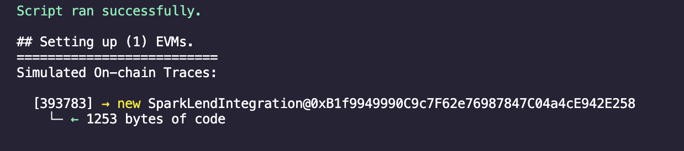
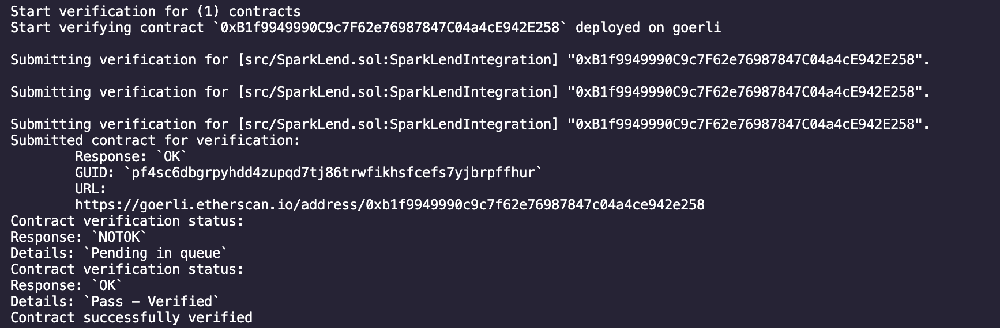
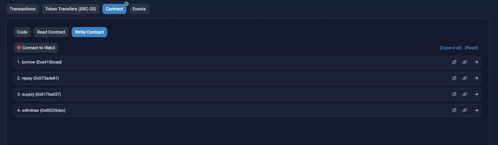

# A quick guide to integrate SparkLend with your protocol

## <u>A brief intro about SparkLend </u>

The SparkLend Protocol is decentralised non-custodial liquidity protocol where users can participate as suppliers, borrowers or liquidators. Suppliers provide liquidity to a market and can earn interest on the crypto assets provided, while borrowers are able to borrow in an overcollateralized fashion. Borrowers can also engage in one-block borrow transactions (”flash loans”), which do not require overcollateralization. [Read more here](https://docs.sparkprotocol.io/developers/sparklend/readme) </br>
In this guide we will cover the basic functions of the protocol and how to start using it in your protocol.

### Step 1: Install a wallet like Metamask

You can install Metamask from [here](https://metamask.io/download/) and follow the steps within. We will be using this wallet for the guide but if you're already using another wallet, which works with EVM you're good to go as well. </br>

### Step 2: Add Goerli testnet to your wallet and get some testnet ETH

SparkLend is deployed in 3 networks - Ethereum Mainnet, Gnosis Chain & Goerli testnet. We will be using Goerli testnet for this guide. </br>
So, go to [Chainlist](https://chainlist.org/) and search for Goerli testnet (enable the 'Include Testnets' check). Click on the 'Add to Metamask' button and it will add the network to your wallet. </br>
Next it's time for getting some Goerli Testnet ETH. There are several sites to get testnet ETH, some are

- [Quicknode's faucet](https://faucet.quicknode.com/ethereum/goerli)
- [Alchemy's faucet](https://goerlifaucet.com/) (here you'd need to have 0.001ETH balance on your mainnet ETH address)
- [Paradigm's faucet](https://faucet.paradigm.xyz/)

### Step 3: Get some testnet DAI

SparkLend supports a few tokens, these are DAI, rETH, wstETH. For this guide we will be using DAI as it can be easily attained. </br>
For this you need to go to [Uniswap](https://app.uniswap.org/swap?chain=goerli). Here you need to connect to **Goerli**. Next, in the swap UI, select ETH as the 'from' token and DAI as the 'to' token. If you can't find DAI or see more than one instances, enter the official token address for DAI which is `0x11fE4B6AE13d2a6055C8D9cF65c55bac32B5d844`. </br>
Next, enter the amount of ETH you want to swap for DAI and click on 'Swap' (~100 DAI should be enough). Confirm the transaction and you will have DAI in your wallet. </br>

### Step 4: Install the SparkLend Walkthrough repo

For this make sure you have Foundry installed. If you don't have it installed, follow the steps [here](https://book.getfoundry.sh/getting-started/installation). </br>
Clone the repo [here](https://github.com/sunosuporno/sparklend-walkthrough), or go to a directory of your choice and run the following command:

```
git clone https://github.com/sunosuporno/sparklend-walkthrough.git
```

### Step 5: Inspecting the smart contracts

Finally, with all the setup done, we can start inspecting the smart contracts. Yay! </br>
In the `src` directory, you'll find the `SparkLend.sol` file. This is the main contract which you'll be interacting with. The contract has the 4 most basic functions of the SparkLend protocol - `supply`, `borrow`, `repay` & `withdraw`. </br>
Let's go through each of these functions one by one. </br>

- `supply` - This function is used to supply assets to the protocol. It takes 4 arguments - `asset`, `amount`, `onBehalfOf` and `referralCode`. `asset` is the address of the token you want to supply (DAI in this case) and `amount` is the amount of tokens you want to supply. The `onBehalfOf` address will be able to withdraw assets from the pool and is also the one to receive the spTokens. The `referralCode` can be 0 for our use case.</br> (Imp note: to call this token you'd need to call `approve` on DAI's contract first to allow it to spend the funds on your behalf) </br>

- `borrow` - This function is used to borrow assets from the protocol. It takes 5 arguments - `asset`, `amount`, `interestRateMode`, `onBehalfOf` and `referralCode`. `asset` is the address of the token you want to borrow (DAI in this case) and `amount` is the amount of tokens you want to borrow. The `interestRateMode` is the type of interest rate you want to borrow at. It can be either `Stable` or `Variable`. The `onBehalfOf` address will be the one to incure the debt. The `referralCode` can be 0 for our use case. </br>

- `withdraw` - This function is used to withdraw assets from the protocol. It takes 3 arguments - `asset`, `amount` and `to`. `asset` is the address of the token you want to withdraw (DAI in this case) and `amount` is the amount of tokens you want to withdraw. The `to` address will be the one to receive the tokens. </br>

- `repay` - This function is used to repay assets to the protocol. It takes 5 arguments - `asset`, `amount`, `onBehalfOf`, `rateMode` and `referralCode`. `asset` is the address of the underlying asset and `amount` is the amount of tokens you want to repay. The `onBehalfOf` address will be the one to repay the debt. The `rateMode` is the type of interest rate you want to repay at. It can be either `Stable` or `Variable`. The `referralCode` can be 0 for our use case. </br>
  Like `supply`, you need to call `approve()` on the underlying asset's contract to allow the protocol to spend the tokens on your behalf. </br>

### Step 6: Deploying the contracts

Now that we've gone through what each function does, it's time to get them on chain! </br>
For this we will be using the `SparkLend.s.sol` file. Before we deploy you need to create a `.env` file in the root directory of this project. Inside the file, you ned to paste the following information: </br>

```
GOERLI_RPC_URL=<your goerli rpc url>
PRIVATE_KEY=<your private key>
ETHERSCAN_API_KEY=<your etherscan api key>
```

The RPC endpoint can be obtained from any provider such as Alchemy, Infura, Quicknode etc. </br>
For the Etherscan API key, just sign into Etherscan directly, and go the 'API Keys' section in your account. </br>
Finally, the private key is the private key of the account you want to deploy the contracts from. </br>
Once you have all the information, you can run the following command to deploy the contracts: </br>

```
forge script script/SparkLend.s.sol:SparkLendScript --rpc-url <Your Goerli RPC endpoint> --broadcast --verify -vvvv
```

If successful, you should see the following outputs: </br>



**If you encounter any error regarding your private key during the deployment, consult the StackExchange page [here](https://ethereum.stackexchange.com/questions/155068/failed-to-parse-as-type-uint256-a-character-is-not-in-the-range-0-9)**

### Step 7: Interacting with the contract

Now you can go to [Etherscan](https://goerli.etherscan.io/) and search for the contract address. You should see the contract with the name `SparkLendScript`. </br>
Go to the 'Write Contract' tab and you should see the 4 functions we discussed earlier. </br>
 </br>
Now, press the connect button and connect your Metamask wallet. Now, you can interact with any of the functions. </br>
Congratulations! You've successfully interacted with the SparkLend protocol using contracts and now you can integrate it with your protocol! 🎉
